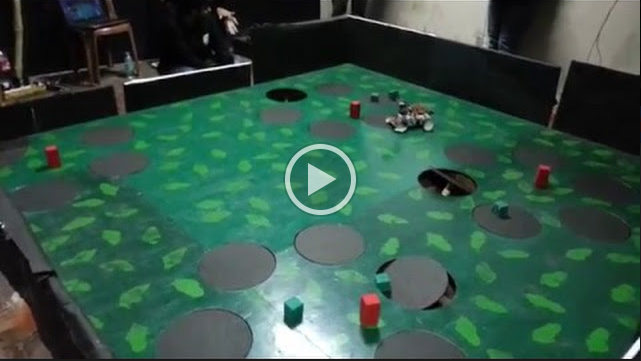

# Gesture-Controlled-Robot
A differential drive robot which can be controlled with smartphone gesture using Bluetooth communication

#Published Research Paper
[R. K. Singh, A. Sarkar, D. Chakravarty, P. Goyal, V. Lodhi and A. Sharma, "Bluetooth communication controlled robot based on gesture recognition," Transportation Electrification Conference (ITEC), 2015 IEEE International, Chennai, 2015, pp. 1-5](http://ieeexplore.ieee.org/document/7386937/)

##Competition Video
[] (https://drive.google.com/open?id=0B4PtoNqc4sQOOEphRzE2WURHejQ)

##Team Members
1. Rahul Kumar Singh
2. Archisman Sarkar
3. Paritosh Goyal

##Reference
